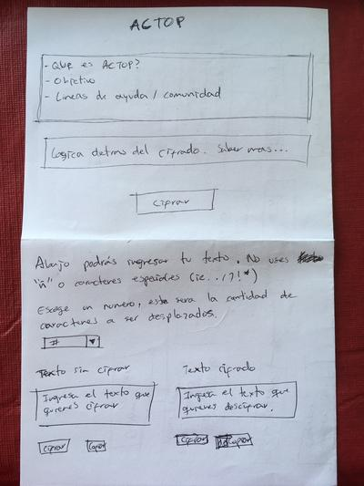
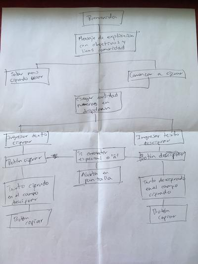

# ACTOP

ACTOP es una aplicación web que permite a personas LGBT que no han salido del clóset, cifrar sus mensajes antes de enviarlos y así evitar que familiares o amigos puedan leerlos.

Utilizamos el mismo principio del [cifrado César](https://en.wikipedia.org/wiki/Caesar_cipher) pero en este caso se puede escoger la cantidad de caracteres que se desplaza.

## Objetivo

Con ACTOP buscamos que nuestros usuarios se sientan seguros de que sus conversaciones no van a poder ser entendidas si alguien las lee sin descifrar. Solo lo podrá leer la persona a la cual se le envíe el mensaje, junto con el numero de caracteres y el link de esta aplicación web para poderlo descifrar.

## Como ayuda ACTOP a los usuarios

- Da un sentido de seguridad de que hay otras personas que están viviendo lo mismo o que lo vivieron en algún momento, y entienden como se siente.
- Informa de herramientas y grupos adicionales de soporte en la comunidad.

## Como acceder

Siendo este un prototipo inicial, esta disponible unicamente en el siguiente link. No requiere descarga o instalación de ningún tipo.

 [https://veronicamanchola.github.io/scl-2018-11-bc-core-cipher/](https://veronicamanchola.github.io/scl-2018-11-bc-core-cipher/)

## Historia de usuario

Como personas pertenecientes a la comunidad LGBT que aun no hayan dado a conocer su sexualidad, queremos una herramienta de cifrado de mensajes para protegerlos de potenciales familiares o amigos que revisen nuestras comunicaciones.

## Diseño

La idea nació al ver la necesidad que había en las personas que temen que su sexualidad va a ser expuesta antes de estar listos, de proteger sus comunicaciones de familiares o amigos que tienden a revisarlas. Desde un inicio se busco un diseño sobrio y simple, que contuviera la cantidad de información necesaria y mencionando el apoyo adicional que existen en otras redes.

 

A medida que se avanzo con la construcción de la app, se vio la necesidad de agregar la capacidad de cifrado para la "ñ", números y caracteres especiales, así mismo se agrego un botón de limpiar para hacer mas amable su uso.
## Planeación

Basados en el diagrama y el diseño, se crearon tareas especificas y se accionaron basadas en su importancia. Todos los detalles se pueden ver en este [tablero de Trello](https://trello.com/b/uOkgmWvF/actop).

